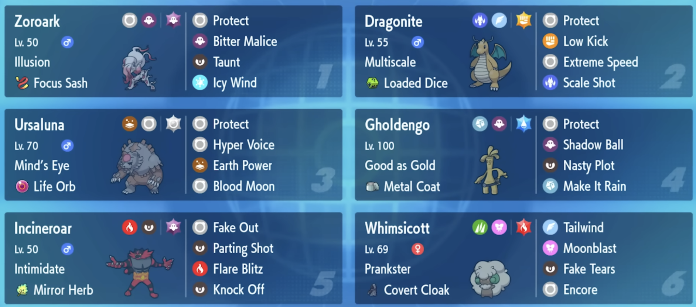

How I Tricked a Pokemon Tournament - YouTube

Transcripts:
There is an ability and competitive Pokemon that, if it ever became popular, could single handedly ruin the game. Imagine a world where you can't trust what you see, where everything might be an illusion. A world where sight, the first line of defense against lurking dangers, is turned against you, your own eyes leading you down a tunnel that never ends.
In this world, seeing isn't believing. In this universe, nothing is guaranteed. Every moment is spent holding your breath. Trying to fight a threat that you cannot see, but you know is there. Or maybe it isn't. You're fighting two battles. The threat itself and the fear. It might sound dramatic, but it's true.
There is a Pokemon ability that makes this nightmare world a reality. It's sinister tendrils warp this game I love, even when the Pokemon doesn't come to the battle. There is one bastion of safety against this era of paranoia; the fact that only one Pokemon gets this ability, and nobody thinks that this Pokemon is very good.
Unfortunately for them, I think they're wrong. This is the story of Illusion and Hisuian Zoroark. But unfortunately for you, dear viewer, this intro itself is an illusion. Because before we can talk about Zoroark, we have to first talk about the greatest city on Earth: Milwaukee, Wisconsin. The Milwaukee Regional Championships will be my first in-person event following last season's World Championships.
They're also the only event I will attend for the first six months of this season, and so if I want to have even a chance to qualify for the World Championships this year, I'm going to have to do well. Unfortunately, this is a difficult task for two main reasons. First, there are over 700 players competing.
Second, the format just changed from the one I spent months trying to master in the lead up to Worlds. Unlike that high power explosive format where legendaries dominate, this new format is the complete opposite because every single legendary and Paradox Pokémon is banned. This is the same format that we played in the months following the World Championships in 2024, and I think it's a lot of fun, but the truth is that I have not touched it in nearly a year, and I've got zero good ideas that I'm sitting on to start building a team.
But while I might not have anything cooking, I have a friend going to Milwaukee who just might have something spicy that has been simmering. Allow me to introduce you to Doctor Aaron Traylor. Aaron and I have been friends since 2011. He's an incredible Pokemon player and one of the single best people I know.
We've worked on teams together countless times over the years, and those collaborations have often taken us to the peak of the game. But after a disappointing finish at the 2023 World Championships, we each went on our own individual journeys, honing our skills and working on our weak points on our own. Now it's time to come together once more.
With no time to spare, we get started. I send Aaron a list of 27 Pokemon that to me, seem underexplored. There's a lot of Pokemon on here that I think have potential: Cetitan, Espathra, Hisuian Braviary, Porygon Z... But out of everything, there's one Pokemon that stands out to him more than all the rest.
Hisuian Zoroark. Now, Hisuian Zoroark is not normally thought to be a very good Pokemon. It fits into this archetype of Pokemon that typically struggle in competitive play, which is fast and frail attackers who try to move before the opponent and do massive damage. In general, I would say that these Pokemon need some sort of X-Factor to boost their attacking prowess in order to make them worth using.
The problem with Hisuian Zoroark is that while it is both fast and strong, it's neither fast or strong enough to justify using it. Faster Pokemon can knock it out in one hit, and although it does not speed a lot of Pokemon in the format, most of them are tanky enough to survive a hit and then to KO Zoroark in return.
And as such, Hisuian Zoroark is seeing almost zero usage. But both Aaron and I think it not only has potential, but could actually win this tournament. Why? Well, the truth is that different aspects of Zoroark appeal to each of us. For me, it's the movepool. Zoroark has mostly been used as the offensive Choice Specs attacker, but I'm thinking what if we use the speed not to do damage, but instead to disrupt our opponents? And there isn't another Pokemon that can do anything similar in this format.
Aaron, on the other hand, is interested in something else. Hisuian Zoroark's unique piping as the only Ghost and Normal type Pokemon, Hisuian Zoroark is the one Pokemon in the game that is completely immune to both Fighting moves and Ghost type moves. That's relevant because one of the single best Pokemon in this format is Annihilape, a Fighting and Ghost type that's able to even KO Pokemon that resist it given that it has enough time to set up.
Unfortunately for them, no matter how many boosts Annihilape gets, it will never be able to do even a single point of damage to Hisuian Zoroark. But, once again, I'm afraid that everything that I've just told you about Zoroark is a bit of magician's redirection, as I ask you to pay no attention to the elephant behind the curtain.
The truth is that neither its typing nor its movepool is the most interesting thing about Hisuian Zoroark. That honor is bestowed upon its ability, Illusion. I would say that it is arguably the single most evil ability present in Scarlet and Violet. Illusion is simple enough to understand: Whenever Zoroark is sent out, it disguises itself as another Pokemon on your team, and there's no way for your opponent to tell them apart.
Specifically, it disguises itself as whichever the last Pokemon you have in your party is, so you get to choose. Now, I mentioned that fast and frail attackers like Zoroark usually need some kind of X-factor, and in theory, that should be Illusion. In a perfect world, Illusion buys you extra chances to attack and do more damage, but if it actually worked in practice, then Zoroark would have some results, right? In fact, doesn't Zoroark having nearly zero tournament finishes kind of imply that Illusion is not some grand magician's Las Vegas act, but instead closer
to like an amateur magician at a kid's birthday party? Now, it's true that Illusion might not have effects that are as immediately powerful as some of the game's most iconic abilities, but make no mistake, this ability is far more dangerous and more frustrating than it would appear at first glance. With Illusion in play, every move becomes a gamble.
Wanna use Fake Out in front of a susceptible target? Well, if that's Zoroark, you just wasted your attack. Want to go for a Close Combat to KO a Pokemon that's weak to Fighting moves? Better think twice. Maybe you think your Ghost type Gholdengo is safe to go for a Nasty Plot. Think again. Without even factoring in half of what Zoroark can do, you can already see how quickly things can devolve.
And trust me, it gets so, so much worse. The theory is there, so Aaron and I decided to try and build around this diabolical ability. We quickly realized that this is not a task for the unmotivated. Building with Zoroark is an emotional roller coaster, punctuated by the moments of also wicked greatness when an opponent tripped over themself playing 'Find the Zoroark'.
And it's a good thing that we have these peaks, because otherwise it's all valleys. Team after team falls flat on its face, as we're met with seemingly endless messages that Zoroark really is a fraud, that there's a good reason that this Pokemon isn't performing. And that reason is because it's bad. But even when I want to give up and try building around a different Pokemon, these moments of trickery, they just keep us hooked.
Aaron and I keep working, and over a few weeks of laborious teambuilding, the terrain finally smooths out. Before we know it, we're careening uphill, leapfrogging off of one Zoroark bamboozlement to the next; and although it's evil, it's a lot of fun. Despite things looking pretty bad for a lot of the prep time, I can now confidently say that we've done it.
We've built a team that makes use of the single most evil Pokemon in the format. This is the team we'll be bringing to the Milwaukee Regional Championships, featuring none other than Hisuian Zoroark. Hisuian Zoroark is the single most difficult Pokemon that I have ever built around. This isn't even because it's a bad Pokemon, but because it restricts your options in a way that no other Pokemon does.
Compare Zoroark to Weezing, whose Neutralizing Gas ability disables all other abilities while Weezing is on the field. At a glance, this probably seems like more of a pain to workaround than Zoroark's Illusion, but in practice, that's not actually the case. With Weezing, you're limited to using Pokémon that don't need to use their abilities, or to Pokemon whose abilities only activate on switch in, or to Pokemon that are holding the Ability Shield item.
When you get down to it, that's actually a lot of Pokemon. But more importantly, the only thing that you need to actually consider is the abilities of these Pokemon. Now let's look at Zoroark. If you disguise Zoroark as any Pokemon that has an ability that activates when the Pokemon is sent out, you immediately blow your cover.
However, you can also dispel your Illusion by disguising Zoroark as any Pokemon with an ability that interacts with your opponent's abilities. For example, Defiant Kingambit or Annihilape being sent out against your opponent's Incineroar. This is also true of certain items, such as the Clear Amulet. All of this is also true of the Pokemon that you aren't disguising as Zoroark as well.
Leading Incineroar next Zoroark immediately tells your opponent that there's only one Pokemon that need to worry about being an Illusion. For this team to work, we need to not only disguise Zoroark well, but we need to make it as hard for our opponents as possible to figure out where and if Zoroark is hiding.
Now, every single thing that I've talked about so far has only been about how to disguise Zoroark. It hasn't actually been about winning the game in any way. Disguising Zoroark correctly doesn't really matter if you can't actually do anything with the ambiguity that you've created. Figuring out the Illusion minigame is important, but it's not as important as treating Zoroark like a Pokemon that will actually do something.
To achieve this, we need to find partners that can both be disguised as Zoroark and can be on the field next to Zoroark, and can be on the field with each other, with Zoroark not present; and every combination of this little triangle has to work well together. And that's not even everything, because I haven't told you yet about the hardest condition of all.
See, the most common move in the game is called Protect. It fully shields the user from all damage and effects for the turn. If you're worried that your opponent might have Zoroark on the field, all you have to do to check is protect both of your Pokemon to see which move they use. Because whilst Zoroark can disguise its appearance, it cannot disguise its moves.
If you protect in front of Zoroark, chances are that next you'll be able to say 'I don't remember Whimsicott learning Bitter Malice'. And just like that, you've solved the case. So you need to disguise Zoroark properly, bave Pokemon that can take advantage of the unique support that it provides, and do all of this while somehow stopping your opponent from Protecting.
Maybe you can see why teambuilding was giving Aaron and I so much trouble. To figure it out, we first needed to determine just what we wanted Zoroark to do. And honestly, out of everything, this is the easy part. The first place to start is with its moves: Protect, Bitter Malice, Icy Wind and Taunt. Bitter Malice is Zoroark's signature move.
While it is technically weaker than Shadow Ball, It has a nice secondary effect of always dropping the target's attack stat, which lets Zoroark support its team by weakening Pokemon that it can't do major damage to. This is a good move, but for me, the biggest draw in using Zoroark was actually Icy Wind. Icy Wind hits both opponents, does a little damage, and lowers their speeds.
The reason that this is so important is because Zoroark is actually one point faster than Alolan Ninetales, who has been dominating tournament with the Focus Sash item. Zoroark can outspeed Ninetales, use Icy Wind to break the Focus Sash and lowered speed at the same time, which allows a partner to pick up the KO before Ninetales can move.
Rounding out the moveset is Protect keep Zoroark safe and Taunt to stop Trick Room teams and Amoonguss, as well as lock opponents out of other options in a pinch. Focus Sash is our item of choice, and it allows Zoroark to not worry so much about its rather poor bulk, instead letting us focus all of its training and its speed and special attack.
Lastly, Aaron I decided that Tera Ghost was the best Tera type, because it allows Zoroark to one hit KO opposing Gholdengo. I hatched like 300 eggs trying to get a shiny Zoroark, but eventually I gave up. I could have done more, but I was getting annoyed, and also I was worried it was going to take away from, like, actually preparing.
I nicknamed my Zoroark 'Surprise!' The nickname doesn't show up properly until after Zoroark disguise is broken, and I just- I thought that was pretty funny. Okay, now is where things get difficult, because we need to start picking partners. The good news is that there is one clear standout choice, and it happens to be one of the best Pokemon in the game: Ursaluna Bloodmoon.
I've nicknamed mine evil Frank because the regular Ursaluna that I ran at Worlds was nicknamed Franklin, and Evil Frank is his brother who is evil. It meets our criteria for partners for Zoroark: its Mind's Eye ability is not only super broken, it also doesn't activate on a switch in or react to any of our opponents abilities.
Ursaluna also happens to be weak to the Fighting moves that we want to bait our opponent into using with Zoroark, and its potential to deal huge damage makes it a popular Fake Out target, where Zoroark's Ghost typing becomes useful yet again. It also pairs well with Zoroark thanks to its absurd damage output.
Its signature move, Blood Moon, is almost as strong as Hyper Beam, and it doesn't even take a turn to recharge. It's made stronger because normally the best type to take normal attacks is Ghost, because they're immune, but thanks to Mind's Eye, the bear does not concern itself with immunities. The two types that resist normal are Steel and Rock, both of which happen to be weak to Earth Power, making Ursaluna nearly impossible to withstand.
Rounding out the moveset is Hyper Voice, which does shocking damage and hits both foes at the same time, and of course, protect help keep Ursaluna safe. To maximize Ursaluna's damage output, we're using both a Life Orb item and a Tera type of Normal. When these multipliers are paired with the already absurdly strong Blood Moon, pretty much any Pokemon that doesn't resist it will go down in a single hit.
Sometimes Urslauna Bloodmoon is trained to be slow and bulky, but not this one. In order to combo with Icy Wind, my Ursaluna is trained to be as fast as possible, allowing it to out speed Rillaboom and Archaludon after a speed drop. This is nice because Ursaluna will then KO them in a single hit, even if they're holding the Assault Vest.
Even though Ursaluna does pair well with Zoroark, the two of them have a problem: they don't actually do anything to discourage your opponent from Protecting, which of course, is where Whimsicott comes in. Whimsicott gives the team a second and more reliable form of speed control, thanks to its Prankster ability.
Prankster causes all moves that don't do damage to act with an increased stage of priority. Moves with increased Priority act before all other moves, no matter how fast the Pokemon using them is. Whimsicott's most important move is Tailwind, which will double my team speeds for the next four turns, allowing Ursaluna to outspeed nearly every Pokemon in the format.
Whimsicott also gets Fake Tears, which cuts the special defense of anything it hits in half. And if you thought Ursaluna was strong before, just wait until you see it doing doubled damage. Moonblast lets Whimsicott do damage on its own, but the set really shines when you consider its final move: Encore. Encore forces whatever it hits to use the last move that it used again for the next three turns.
And thanks to the Prankster ability, it'll almost always land before the opponent can switch moves. The presence of Encore means that the normally safe tactic of Protecting suddenly becomes incredibly risky, because you do not want to get stuck using Protect turn after turn. Even without Protecting the mix, it's really risky to play passively in front of Whimsicott, because if you don't do any damage while Tailwind is set up, then Fake Tears becomes a massive threat, pairing with both Ursaluna and Zoroark.
Whimsicott pressures opponents to go on the offensive or else risk losing massive ground, and in doing so, it sets Zoroark up to set up for surprise KOs. It is the Pokemon that I will disguise Zoroark as the most over the course of this tournament. Fake Tears also happens to be the reason why my Whimsicott card is nicknamed 'So Sad ;)' Whimsicott's holding the Covert Cloak item to ensure that it doesn't have to worry about Fake Out.
Tera Fire is used to not only resist Fire moves from sun teams, but also the Steel type move Make It Rain from Gholdengo. Speaking of the final Pokemon, completing the core four of this team is none other than Mr. Moneybags himself. I do not like Gholdengo. It is a stupid, overpowered, broken Pokemon. But even though I technically can beat them, sometimes it's good to join them anyway.
Now, Gholdengo is a weaker Pokemon to disguise Zoroark as than either Whimsicott or Ursaluna Bloodmoon. It  doesn't pressure the opponent to make risky attacks in the same way that Whimsicott does, and it doesn't bait Fighting moves or Fake Out like Ursaluna does. However, Gholdengo is a better partner to have on the field next to Zoroark than either Whimsicott or Ursaluna.
Remember earlier how I told you that I could use Zoroark's Icy Wind attack to drop Ninetales' speed and then KO it before it could move? Well, Whimsicott is not strong enough to KO Ninetales, and Ursaluna isn't fast enough to speed it after a speed drop. And that's where Gholdengo comes in. Its signature move, Make It Rain, is one of the single best moves added in Scarlet and Violet, hitting both foes and dealing massive damage.
It can also use Shadow Ball to hit opposing Gholdengo for super effective. Protect keeps it safe, but its most dangerous move is actually one that doesn't do any damage at all: Nasty Plot. See, Make it Rain drops Gholdengo's special attack by one stage whenever it hits something, and Nasty Plot increases your special attack by two stages whenever it's used, so you can use this to either remove the drops from Make It Rain, or to boost up before attacking in the first place.
Gholdengo also combos with Zoroark's Bitter Malice, which can weaken foes' attack stats while Gholdengo sets up. Nasty Plot also applies immense pressure on your opponents to not Protect, as if you don't do any damage when Gholdengo sets up, you can easily lose the game. Gholdengo's holding the Metal Coat item to further boost Make It Rain, and is using a Tera Type of Water to help vs rain teams, as well as other Gholdengo.
It's trained to be as fast and as strong as possible, but it's using a special attack-boosting nature, rather than a speed-boosting one, which is currently more popular. I think the extra power will be more important because I have both Tailwind and Icy Wind, so hopefully I'll be able to move before most of their Gholdengo naturally.
I decided I wanted to use shiny Gholdengo to increase confusion with Illusion, but I didn't have one, so I want to say a big thank you to my friend Billa for lending this one to me, because I didn't want to collect another 999 coins, and I also didn't have a shiny Gholdengo sitting around. It's nicknamed Layla, which I'm pretty sure is the name of my friend Yotam's cat; I got this from Billa, it was already nicknamed, I don't know why it's nicknamed after Yotam's cat.
Yotam, if you're watching this, you can let me know. Now, these four Pokemon form a very scary complete core, where any Pokemon can be Zoroark or can be on the field next to Zoroark. But these four Pokemon also have some pretty big weaknesses. The single biggest issue is Kingambit. Many of them will run the Assault Vest item, which is kind of tough when I have four special attackers on the team, and even beyond that, Goldengo, Whimsicott and Zoroark all can't damage Kingambit at all, regardless of whether or not they're holding the Assault Vest.
Even worse, every one of Zoroark's moves that do any damage also drop one of your foe's stats, meaning that Zoroark can't even attack without activating Kingambit's Defiant ability. The other weakness for the team right now is Trick Room teams. Since Trick Room flips the speed order around, it turns both Tailwind and Icy Wind against my team, and so the fifth Pokemon added to the team is none other than the greatest Pokemon ever made: Incineroar.
Now, you're watching a WolfeyVGC video, so you're probably not surprised to see Incineroar on the team, but based on everything that I've told you thus far, you might be surprised to see Incineroar on this team. Incineroar does help against Trick Room teams, as they normally rely on strong Psychic and Fire type moves to do burst damage.
But what about the other criteria? What about Zoroark? Well, it's true that you cannot disguise Zoroark as Incineroar. Its Intimidate ability activates on switch in, which would immediately shatter the Illusion, assuming your opponent's paying attention. But remember that in every battle, you always get a choice for which Pokemon you disguise Zoroark as.
With two Pokemon in the back at the start of the game, and Zoroark always taking the form of the last Pokemon in your party, I am never forced to disguise Zoroark as Incineroar. In other words, because Zoroark can be disguised as every other Pokemon on this team and will never end up getting stuck doing a bad Incineroar impression.
Incineroar and Zoroark together also isn't a very good lead, so that issue isn't a big deal either. But what about King Gambit? Well, on paper, Incineroar looks pretty good against the Supreme Overlord: with its Fire and Dark typing, it resists Kingambits Dark and Steel type moves. The issue, of course, is the abilities.
Kingambit's Defiant ability gives it two stages of attack increase whenever one of the stats is lowered, and Incineroar's Intimidate ability lowers both your opponent's attack stats every time it switches in. If Incineroar switches in against Kingambit, it gives over a +1 attack boost, and trust me, you do not want to deal with attack boosted Kingambit.
But there is a way for Incineroar to turn this interaction against Kingambit; to cause this unavoidable ability dance to swing in the cat's favor. See, a new item was introduced in Scarlet and Violet that, I must admit, I have pretty much only used to get egg moves on existing Pokemon, but as it turns out, it actually does something in battle too.
It's called the Mirror Herb and its effect is simple: Once per battle, when your opponent gets a stat boost, consume the herb and get that same stat boost for yourself. If Incineroar is holding the Mirror Herb, suddenly it's Kingambit who needs to be careful because the interaction plays out differently. Incineroar is sent out, Intimidate activates, putting Kingambit at -1 attack; the fight activates, giving Kingambit a +2 boost, leaving it with a net +1 attack, and then Mirror Herb activates, copying only the Defiant +2 boost,
not the final +1 that Kingambit ends with. This means that Incineroar has now doubled its attack stat and can cleanly OHKO Kingambit. Incineroar is running a standard moveset of Fake Out, Parting Shot, Knock Off and Flare Blitz, but unlike my usual bulky incineroar spread, this one is giga fast. It's so fast that with Tailwind active, it'll outspeed most Dragapult and +1 speed Dragonite.
It also speed most Ursaluna, and Ursaluna Bloodmoon outside of Tailwind, letting me Knock Off or Parting Shot before they can move- The rest of the stat points are distributed to let it survive Sneasler's Close Combat after an Intimidate and Ursaluna Bloodmoon's Earth Power. Aaron and I decided to use Tera Ghost for the immunity to Fake Out and Fighting type moves.
This can pair really well with Encore on Whimsicott, because you can Encore them to a Fighting move as you Tera Ghost and then end up immune. Now, the game will not let me nickname Incineroar, because the one that I'm using is the special Mystery Gift one that was distributed after I won EUIC last season.
Those of you up to date on the lore already know that this is officially, canonically, my Pokemon. Whatever you send it out in battle, the game tells you with the title 'Wolfe's Incineroar'. And if you're curious, I think the reason that you can't nickname it is because otherwise when you send it out, you would say like go and then the nickname of the Pokemon, but it would still have the title 'Wolfe's', so you could say stuff like 'Go, Wolfe's left calf!' and you can probably imagine that there are some things
that you can say that they don't want you saying. Anyway, with only one Pokemon fight left on the team, Eren and I were stumped. The issue is that we needed a Pokemon that can resist Water moves, but even with Incineroar a special herb, we also still needed more for Kingambit. We tried so many Pokemon: Azumarill, Flamigo, Sneasler, Poliwrath, Kommo-o, Tauros-Aqua, Tauros-Blaze... but nothing worked.
I really thought Azumarill was going to work. I really thought Flamingo was going to work, but- But neither of them did; we needed Keldeo. We needed Urshifu. Anyway, as it turns out, when you want to resist both Water and Dark type moves and Urshifu was not around, it seems like the Pokemon that you're looking at just aren't as good as you need them to be.
Which is why, eventually, we realized that we weren't going to get a Pokemon that resists both Water and Dark type moves, at least not at the same time. But as it turns out, as long as it can resist both of them some of the time, that was good enough. Allow me to introduce you to the final Pokemon on the team: Dragonite Dragonite is one of the best Pokemon in the current format.
Not only does it have good bulk and a great attack stat, but it's been given a number of great new tools in the last few generations. Most importantly is the new move Scale Shot and the new item Loaded Dice. Scale Shot is a move that hits between 2 and 5 times, and then lowers Dragonite defense stat and raises its speed.
The Loaded Dice item causes this move to always hit between 4 and 5 times, and for context, five hits of Scale Shot is stronger than Outrage, and even only four hits, which is the low roll option, is roughly as strong as Life Orb Dragon Claw. The speed boost means that Dragonite can run away with the game, as it becomes faster and faster every turn, eventually outspeeding even the fastest Pokemon in the format.
The defense drop is also offset somewhat by Dragonite's ability Multiscale, which cuts all damage taken in half as long as Dragonite is at full HP. With its Dragon typing, extra bulk from Multiscale and ramping speed, Dragonite is a strong choice to help with the rain teams that have been giving Aaron and I some trouble, and that is all well and good, but what about the other problem? What about Cringegambit? Well, here's where our Dragonite diverges from the more standard ones of the format.
Normally, the last two moves that Dragonite uses are Tailwind for speed control and Haze to remove stat boosts and stat drops. Haze is useful for like opposing setup Pokemon like Dondozo, but it's also good because you can clear your own stat drops, which are going to be getting from lowering your defense with Scale Shot and maybe Intimidate from opposing Incineroar.
However, this team already has Whimsicott for Tailwind, so Dragonite doesn't need Tailwind as well, and with Fake Tears, Intimidate, Nasty Plot, Bitter Malice and Icy Wind all present on the team, Haze feels like it's likely to do more good for the opponent than for us, so suddenly Dragonite has two move slots left open.
One of them we'll dedicate to Extreme Speed. Thanks to its heightened priority, it can finish off low HP foes, and it can also be used to attack before Sucker Punch from Kingambit, which will cause the move to fail. This is going to be relevant in a second, trust me, because Extreme Speed is not very effective against the Steel type Kingambit.
But that's not the case for Dragonite's final move: Low Kick. Low Kick is almost never used on Dragonite, and certainly never used on Multiscale Scale Shot Loaded Dice Dragonite. But the thing is, I think it's exactly what we need here. It's a Fighting type move that does more damage the heavier the target is, and as it turns out, when you put can get but on the scale, it counts the chair.
Because both of Kingambit's types are weak to Fighting, Low Kick will always KO; unless, of course, they Terastallize. The most common Tera type for Gambit is Dark, and Dark is still weak to Fighting, turns out that cutting your damage taken in half is enough to keep Kingambit alive. Unless, of course, Dragonite also Terastallizes, and in this case, the Tera type of choice is none other than Tera Fighting.
Tera Fighting Dragonite Low Kick does enough damage to Tera Dark Kingambit that... it doesn't KO, but after they Terastallize to Dark, they lose the Steel typing, and that means that Extreme Speed can then finish it off. Fighting also is nice because it gives Dragonite a Dark resistance, so we don't have to be as afraid of Sucker Punch.
Tera Fighting Low Kick has some other uses as well- like, you can KO the Ursalunas, and you can use it to let Dragonite resist the Rock type moves from Tyranitar and Excadrill that are actually kind of annoying for this team. This moveset is really weird and not very standard, but it is a specific kit designed for this specific team and it ends up tying everything together, being the perfect final Pokemon.
Dragonite is trained to be as fast and as strong as possible, and is nicknamed '#1 Gio Fan', after my friend, editor and incredible documentarian Gio. Dragonite's his favorite Pokemon. I think. I'm pretty sure. Dragonite has the title 'The Sleepy'. Fun fact, it took me 30 minutes to get the shiny marked Dragonite, and another 30 minutes to get shiny marked Whimsicott, but three hours wasn't enough to get a single shiny Zoroark.
I'm still a little pissed. As Aaron and I and I were putting the final touches on the team, we actually realized that this is exactly the style of team that our friend Yuki really enjoys using. Yuki is going to Milwaukee, but he didn't have much time to prepare for the tournament due to being super busy with work.
So about two weeks before the tournament, we sent him what we'd been working on and asked if he wanted to use it, and he thought it looked good, so he said yes. Now, if you want to use the team yourself, you can do so using the rental code that's on screen here. 

