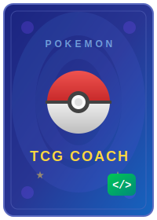

  

<h1 align="center">Pokemon TCG Coach</h1>

AI coaching skill for Pokemon TCG — rules, deckbuilding, card search, collection management, and meta analysis.

## Capabilities

- **Rules & Legality** — Answer rules questions, check card/set legality by format
- **Deckbuilding** — Help build competitive decks with proper ratios and strategy
- **Meta Analysis** — Current top archetypes with strengths, weaknesses, and matchups
- **Card Search** — Find cards by name, type, set, HP, regulation mark
- **Collection Tracking** — Import your cards, save decks, track what you own
- **Purchase Advice** — What to buy to complete a deck, singles vs sealed guidance

## MCP Tools

| Tool | Purpose |
|------|---------|
| `card-search` | Search Pokemon TCG cards by name, set, type, regulation mark |
| `collection-import` | Import PTCGL card list into collection |
| `collection-view` | View card collection with filters |
| `collection-remove` | Remove cards from collection |
| `deck-save` | Save a PTCGL decklist |
| `deck-list` | List all saved decks |
| `deck-get` | Retrieve a saved deck |
| `deck-delete` | Delete a saved deck |
| `deck-diff` | Compare deck vs collection — what's missing? |

## Data Sources

- **Card data:** [tcgdex API](https://tcgdex.dev) (free, open, no authentication)
- **Rules & strategy:** Curated reference files in `references/`
